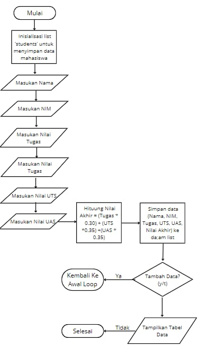
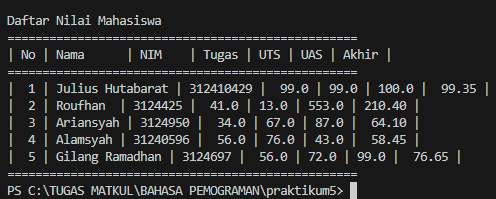

# Pratikum4

- Nama : Julius Hutabarat
- NIM : 31210429
- Kelas : TI.24.A.3

---

## Deskripsi
Program ini dirancang untuk memungkinkan pengguna menambahkan data ke dalam sebuah list (daftar) di Python. List adalah struktur data yang dapat menyimpan berbagai jenis data dalam urutan tertentu. Program ini menggunakan input dari pengguna untuk menambahkan item ke dalam list, dan pengguna dapat memilih untuk menambahkan lebih banyak data sesuai kebutuhan.

---

## Program Membuat Data Nilai Mahasiswa

### Deskripsi Program:
Program ini bertujuan untuk mengelola data akademik mahasiswa dengan cara menerima input dari pengguna berupa Nama, NIM, Nilai Tugas, Nilai UTS, dan Nilai UAS. Setelah input data diterima, program menghitung Nilai Akhir berdasarkan bobot yang telah ditentukan, yakni 30% untuk nilai Tugas, 35% untuk nilai UTS, dan 35% untuk nilai UAS.

### Kode Program
Kode program dapat dilihat dibawah ini atau buka file ini [`ProgramNilai.py`](programnilai.py).
```python
def calculate_final_score(tugas, uts, uas):
    return (0.3 * tugas) + (0.35 * uts) + (0.35 * uas)

def main():
    data_list = []
    
    while True:
        print("\nInput Data Mahasiswa")
        name = input("Nama: ")
        nim = input("NIM: ")
        tugas = float(input("Nilai Tugas: "))
        uts = float(input("Nilai UTS: "))
        uas = float(input("Nilai UAS: "))
        
        final_score = calculate_final_score(tugas, uts, uas)
        data_list.append({
            'name': name,
            'nim': nim,
            'tugas': tugas,
            'uts': uts,
            'uas': uas,
            'final_score': final_score
        })
        
        more_data = input("Tambah data (y/t)? ").strip().lower()
        if more_data != 'y':
            break
    
    # Display data in table format
    print("\nDaftar Nilai Mahasiswa")
    print("=" * 50)
    print("| No | Nama      | NIM    | Tugas | UTS | UAS | Akhir |")
    print("=" * 50)
    
    for i, data in enumerate(data_list, start=1):
        print(f"| {i:2} | {data['name']:8} | {data['nim']:6} | {data['tugas']:5} | {data['uts']:3} | {data['uas']:3} | {data['final_score']:6.2f} |")
    
    print("=" * 50)

if __name__ == "__main__":
    main()
```

### Penjelasan Program:
1.Input Data: Pengguna diminta untuk memasukkan informasi untuk setiap mahasiswa, termasuk Nama, NIM, Nilai Tugas, Nilai UTS, dan Nilai UAS.
Tambah Data: Setelah memasukkan satu set data, program menanyakan apakah pengguna ingin menambahkan data lagi. Jika y (ya), program akan meminta input data mahasiswa baru; jika t (tidak), program akan berhenti meminta data dan langsung menampilkan daftar.
Tabel Output: Setelah selesai, program akan menampilkan tabel yang berisi nomor urut, nama mahasiswa, NIM, nilai tugas, UTS, UAS, serta nilai akhir yang telah dihitung.
Nilai Akhir:
Nilai akhir dihitung berdasarkan formula:

Nilai Akhir
=(0.3×Nilai Tugas)+(0.35×Nilai UTS)+(0.35×Nilai UAS)Nilai Akhir=(0.3×Nilai Tugas)+(0.35×Nilai UTS)+(0.35×Nilai UAS

Contoh:

Ari: (0.3×70)+(0.35×65)+(0.35×80)=71.75
(0.3×70)+(0.35×65)+(0.35×80)=71.75
Bambang: (0.3×65)+(0.35×80)+(0.35×90)=79.00
(0.3×65)+(0.35×80)+(0.35×90)=79.00

### Flowchart:
Flowchartnya adalah sebagai berikut:



### Screenshot Hasil Eksekusi Program:
Berikut adalah hasil programnya:


